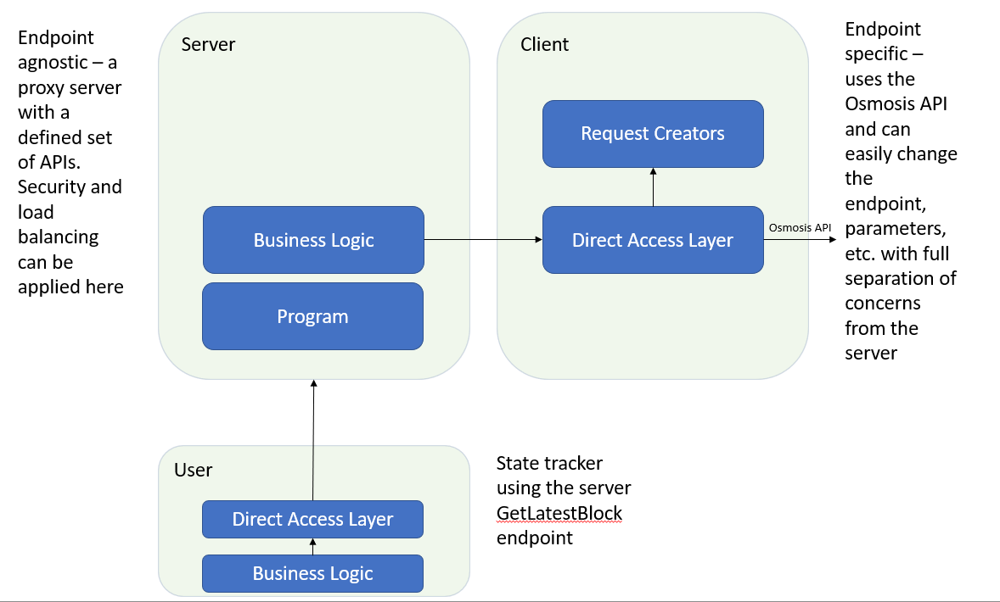

# Lava Labs home assignment

Hello, my name is Ben Goldschmidt, I’m 29, originally Swedish, lived in Israel for most of my life, and currently split my time between Israel and the US, which I’m in the process of moving to (following my American fiancé 😊) starting the green card process.

I would like to thank you for the opportunity working on the exercise and learning new technologies, as I don't have prior experience with gRPC or Cosmos.

A bit about my technical background - I have been a software engineer at Microsoft for the last 4 years, building a new cloud product called Cloud for Financial Services, serving banks like HSBC using a wide range of technologies (C#, .NET, React, Microsoft CRM, CI/CD, etc.).

## High level design

### Server

The server defines a set of APIs using a proto file. The APIs return schema is similar to the Osmosis return schema, as defined in the exercise. The input parameters are also set to be the same, but this is a matter of choice and isn't mandatory (a matter of design and requirement choices). Each API endpoint is completely agnostic to the gRPC endpoint - the server does not care where the request is going to or what the schema for calling it is.

As to technical issues with Cosmos gRPC documentation, I could not generate the proto file to create the return parameters schema - the steps I've taken are:

1. Look for the proto documentation and code.
2. Generate the proto file from a docker as defined in the documentation. 
3. The docker does not include the generating script in its file system (after executing find operations).

I have decided that pasting and gathering the proto files manually or creating a script to collect them is a bit of an overkill for the exercise, hence I've set the return schema as a json string.

### Client

The client is endpoint specific and defines the API calls made to the Osmosis API. I've used an open source code base (the only one I could find) supporting the Cosmos API for .NET, located here - https://github.com/usetech-llc/cosmos_api_dotnet.
The client is made of 2 main components:

1. Request Creators - these are specific classes that are incharge of defining and executing the requests for each specific API defined in the server. They inherit from a generic class that is used by the direct access layer (defined in section 2) and are responsible for getting the parameters from the server and addapting them to whichever endpoint we define - in our case, the Osmosis endpoint. These classes enable separation of concern from the server, and require only changes in the specific request instance when we wish to change the endpoint, sent parameters, etc.
2. ClientDal - a direct access layer that is responsible for executing and retrieving the responses from the endpoints defined in the Request Creators. I am using a ClientResult instance to keep track of the execution result, keep the error message if applicable and the actual result from returned from the endpoint. These are later sent back to the server.

I have encountered an issue with the .NET library supporting the Cosmos SDK. I was unable to make gRPC calls to the Osmosis endpoint, trying to use different endpoints urls available in different documentations. This was my main issue preventing me from forwarding the calls from the user and actually communicating with the Osmosis endpoint. I am not sure (though I assume the support is better for Go) if this is an issue with the .NET support or a general availability with the servers, having many of the responses stating server inavailability. 

### User

The user is a gRPC client project that makes calls to the server we've defined through a direct access layer for separation of concerns. The business logic is responsible for collecting information from 5 blocks at a time, and building the lines in the json files as described in the exercise.

The business logic contains the main logic of the user - I was under the assumption that blocks are written slower than the time it takes for the request to be executed, hence it is enough to make the GetLatestBlock calls and check whether the height of the block is larger than the one beforehand. We keep a global parameter that saves the height for later 5-block groups. There are a few additions I believe can be introduced for better performace and scalability:
- Given a posiblity to use a web socket on Osmosis side, we could have implemented a system that waits for new block events - meaning we subscribe to the socket channel that sends us event once a block is writen. Once that happens we write the block as described and wait for the next event. This approach is by far less resource extensive, since we're currently constantly querying for new blocks and check whether they are indeed new.
- Another addition we could add is a retry system, given errors in the endpoint for our server API - for example retry sending the request for several minutes in different / constant time frames until we eventually kill the execution. 

## How to use

To use this project, pull the latest from master here () and use Visual Studio to build and run the server. After the server is running, run the user project. I've uploaded all the files into the repo, so there shouldn't be any configurations or imports needed to run it (though as I described, the project is not returning results as requested due to the technical issues described above).

