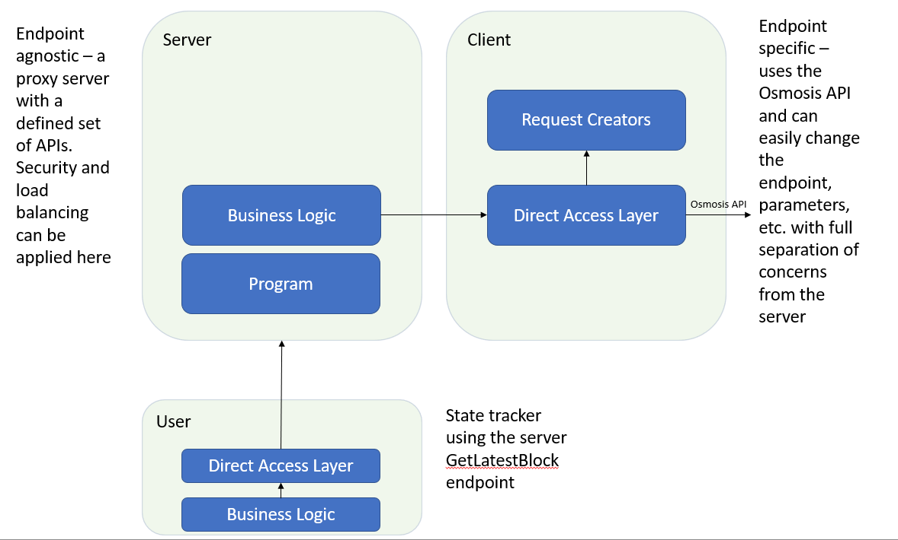

# Lava Labs home assignment

I would like to thank you for the opportunity working on the exercise and learning new technologies, as I didn't have prior experience with gRPC or Cosmos.

## High level design

### Server

The server defines a set of APIs using a proto file, leveraging proto buffs. The APIs return schema is similar to the Osmosis return schema, as defined in the exercise. The input parameters are also set to be the same, but this is a matter of choice and isn't mandatory (a matter of design and requirement choices). Each API endpoint is completely agnostic to the gRPC final endpoint - the server does not care where the request is going to or what the schema for calling it is. The server business logic is responsible for executing each of the API endpoints defined in the proto file, calling the Client DAL (direct access layer) and mirroring the responses / errors raised as a response. Potentially, it can also apply security aspects and load balancing.

As to technical issues with Cosmos gRPC documentation, I could not generate the proto file to create the return parameters schema - the steps I've taken are:

1. Look for the proto documentation and code.
2. Generate the proto file from a docker as defined in the documentation. 
3. The docker file system does not include the generating script (after executing find operations). Other scripts available are not giving the desired outcome.

I have decided that pasting and gathering the proto files manually or creating a script to collect them is a bit of an overkill for the exercise, hence I've set the return schema as a json string.

### Client

The client is endpoint specific and defines the API calls made to the Osmosis API (which can be changed to be any other endpoint we desire). I've used an open source code base (the only one I could find) supporting the Cosmos API for .NET, located here - https://github.com/usetech-llc/cosmos_api_dotnet.
The client is made of 2 main components:

1. Request Creators - these are specific classes that oversee defining and executing the requests for each specific API defined in the server. They inherit from a generic class that is used by the direct access layer (defined in section 2) and are responsible for getting the parameters from the server and adapting them to whichever endpoint we wish to use - in our case, the Osmosis endpoint. These classes enable separation of concern from the server, and require only changes in the specific request instance when we wish to change the endpoint, sent parameters, etc.
2. ClientDal - a direct access layer that is responsible for executing and retrieving the responses from the endpoints defined in the Request Creators. I am using a ClientResult instance to keep track of the execution result, keep the error message if applicable and the actual result returned from the endpoint. The result is later sent back to the server.

I have encountered an issue with the .NET library supporting the Cosmos SDK. I was unable to make gRPC calls to the Osmosis endpoint, trying to use different endpoints urls available in different documentations. This was my main issue preventing me from forwarding the calls from the user and communicating with the Osmosis endpoint. I am not sure (though I assume the support is better for Go) if this is an issue with the .NET support or a general availability with the servers, having many of the responses stating server unavailability or SSL issues. I have also tried using the HTTPS endpoints without success, stating server unavailability responses. 

### User

The user is a gRPC client project that makes calls to the server we've defined through a direct access layer for separation of concerns. The business logic is responsible for collecting information from 5 recent blocks at a time and building the lines in the json files as described in the exercise.

The business logic contains the main logic of the user - I was under the assumption that blocks are written slower than the time it takes for the request to be executed, hence it is enough to issue the GetLatestBlock calls and check whether the height of the block is larger than the one beforehand. We keep a global parameter that saves the height of the last block to make sure similar blocks are not repeated. 

There are a few additions I believe can be introduced for better performance and scalability:
- Given a possibility to use a web socket (channel stream) on the Osmosis side, we could have implemented a system that waits for new block events - meaning we subscribe to a channel that sends us event once a block is written. Once that happens, we write the block as described and wait for the next event. This approach is by far less resource intensive, since we're currently constantly querying for new blocks, checking whether they are indeed new.
- Another addition we could add is a retry system, given errors in the endpoint for our server API - for example retry sending the request for several minutes at different / constant time frames until we eventually kill the execution. 

## How to use

To use this project, pull the latest from master here (server - https://github.com/beng930/LavaIntroExerciseServerDOTNET, user - https://github.com/beng930/LavaIntroExerciseUserDOTNET/tree/master) or use the given .zip file I provided. Use Visual Studio to build and run the server. After the server is running, run the user project. I've uploaded all the files into the repo, so there shouldn't be any configurations or imports needed to run it (though as I described, the project is not returning results as requested due to the technical issues described above).

